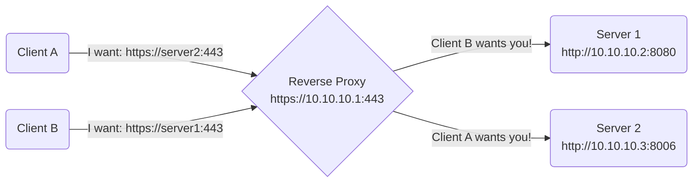

### Overview
---
A reverse proxy is a server that sits in front of web servers and forwards client (e.g. web browser) requests to those web servers.  A reverse proxy allows multiple sites on different servers to be accessed through a single IP address, as well as centralize & simplify SSL certificate usage (e.g., individual servers can run over different HTTP ports, while the proxy forces clients to use HTTPS).


(*Note: in the above diagram, the DNS records for `server1` and `server2` point to `10.10.10.1`*)

### Example Configuration
---

To configure NGINX as a reverse proxy to redirect to your internal services while utilizing HTTPS on port 443, you can follow these steps. Assuming you already have NGINX installed (`sudo apt install nginx`), here's a basic configuration example for most use cases:

#### 1. Create SSL Certificates

- You'll need SSL/TLS certificates for your domain and each internal service you want to proxy. You can obtain free certificates from Let's Encrypt using Certbot.  Alternatively, you can use [OPNsense as a local CA and create local certificates](../../01.%20Infrastructure/OPNsense/Creating%20Internal%20CA's%20and%20Certificates.md) for a homelab (example domain: `homelab`).
	-  **Note:** the homelab certificate should be for your proxy's IP and target service's domain name (e.g., `server_name`).  Failure to do so will result in a "Certificate is not valid" error.

#### 2. Configure NGINX

- Create a configuration file for NGINX that defines your reverse proxy settings. You can use the default NGINX configuration file located at `/etc/nginx/nginx.conf` or create a new one in `/etc/nginx/sites-available/`.

- Here's an example configuration file (`/etc/nginx/sites-available/reverse-proxy`):

```nginx
server {
    listen 443 ssl;
    server_name proxmox.homelab;

    ssl_certificate /etc/nginx/ssl/proxmox.crt;
    ssl_certificate_key /etc/nginx/ssl/proxmox.key;

    location / {
        proxy_pass https://<proxmox_ip>:8006;
        proxy_set_header Host $host;
        proxy_set_header X-Real-IP $remote_addr;
        proxy_set_header X-Forwarded-For $proxy_add_x_forwarded_for;
        proxy_set_header X-Forwarded-Proto $scheme;
    }
}

server {
    listen 443 ssl;
    server_name opnsense.homelab;

    ssl_certificate /etc/nginx/ssl/opnsense.crt;
    ssl_certificate_key /etc/nginx/ssl/opnsense.key;

    location / {
        proxy_pass http://<opnsense_ip>:80;
        proxy_set_header Host $host;
        proxy_set_header X-Real-IP $remote_addr;
        proxy_set_header X-Forwarded-For $proxy_add_x_forwarded_for;
        proxy_set_header X-Forwarded-Proto $scheme;
    }
}

# Repeat the above server block(s) for other services (e.g., Wikijs, PiHole, etc).

server {
    listen 443 ssl default_server;
    server_name _;

    ssl_certificate /etc/nginx/ssl/proxy.crt;
    ssl_certificate_key /etc/nginx/ssl/proxy.key;

    return 404;
}
```

- In this example, replace the certificates  (`.crt`) and certificate keys (`.key`) with the actual paths to your SSL certificate and private key files.

#### 3. Create Symbolic Link

- Create symbolic links to your configuration file in the `/etc/nginx/sites-enabled/` directory:
```shell
sudo ln -s /etc/nginx/sites-available/reverse-proxy /etc/nginx/sites-enabled/
```

#### 4. Test Configuration

- Check the NGINX configuration for syntax errors:
```shell
sudo nginx -t
```

- If there are no errors, reload NGINX to apply the changes:
```shell
sudo systemctl reload nginx
```

#### 5. DNS Configuration

- Ensure that DNS records for your proxied domains (e.g., `proxmox.homelab`, `opnsense.homelab`, etc.) all point to the IP address of the NGINX proxy server.

#### 6. Firewall Rules

- Make sure your firewall allows incoming traffic on port 443, and that there are no firewall rules blocking your proxy from reaching your target servers.

Now, your proxy should be setup to route traffic to internal services through a single host using HTTPS on port 443. Remember to renew your SSL certificates when needed and adjust the NGINX configuration if you add more services.
