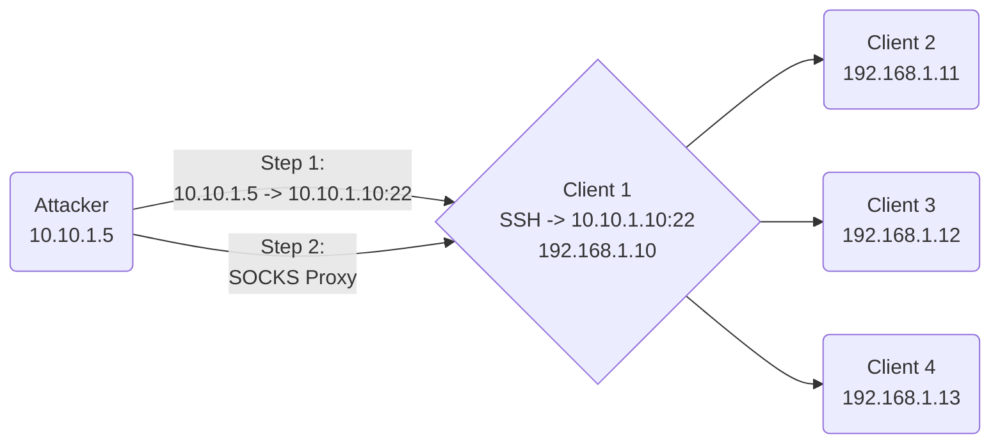

> [!info]
> This note is still in development.
## Overview
---
**SSH** tunneling or SSH port forwarding is a method of creating an encrypted SSH connection between a client and a server machine through which services ports can be relayed.
## Usage
---
### SOCKS Proxy (Tunneling)

On our attacker, modify the last line of `/etc/proxychains4.conf` to utilize SOCKS5, and take note of the proxy port.
```shell
sudo nano /etc/proxychains4.conf
```

![[Pasted image 20230306165438.png]]

Below is one of the simplest and most straight forward tunnelling methods, useful for when you have SSH credentials to a box.
```shell
# Terminal 1: Establish a tunnel into the network
ssh <user>@<ip_address> -p <ssh_port> -D <proxy_port>

# Terminal 2: Proxy commands through victim
proxychains -q <command>
```

This will start an `ssh` tunnel and allow us to tunnel commands through the SOCKS5 proxy using `proxychains`.

**Visual Diagram:**


*(Note: in the above example, the attacker established an `SSH` tunnel with Client 1.  This allows the attacker to now reach Clients 2-4 through `proxychains`.)*

### Port Forwarding

Uhhhh....